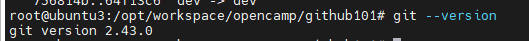

Git 工具安装与使用报告
学员 GitHub 用户名: wiselyXu
我是老程序员， 都安装过好多次， 这个就不细写了， 直接截图我的 git --version

1. Git 安装过程
   操作系统：Ubuntu 22.04 LTS (x86_64)
   安装方法：使用 APT 官方源一键安装

2. 遇到的问题及解决方法

3. 版本信息截图

 4. Git 命令使用过程总结
（在此处总结使用 Git 命令的过程，包括但不限于以下操作：

git clone: 克隆远程仓库到本地
git add: 添加文件到暂存区
git commit: 提交更改到本地仓库
git push: 推送更改到远程仓库
git pull: 从远程仓库拉取最新更改 等其他相关命令的使用体验和理解）
